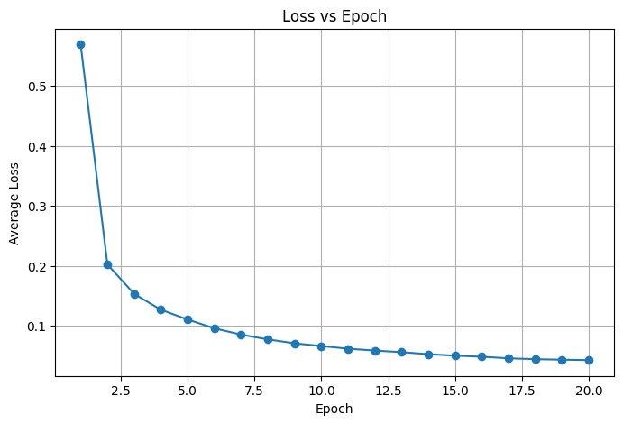
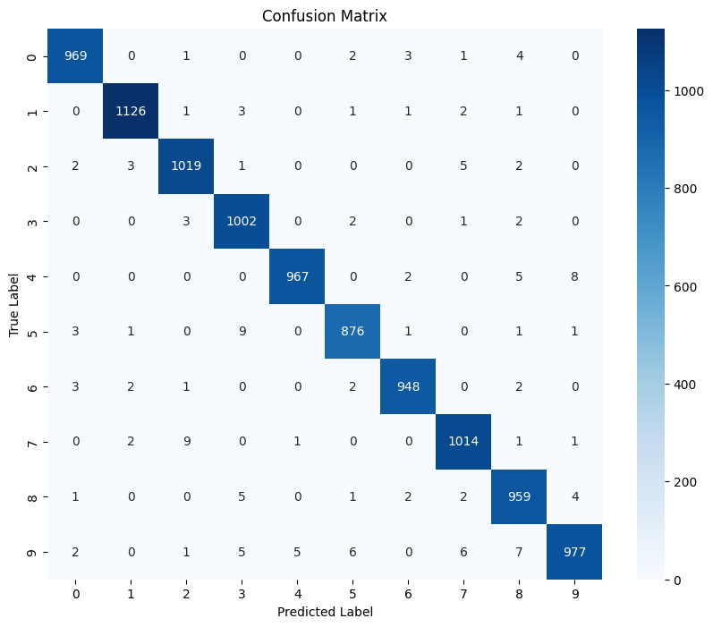
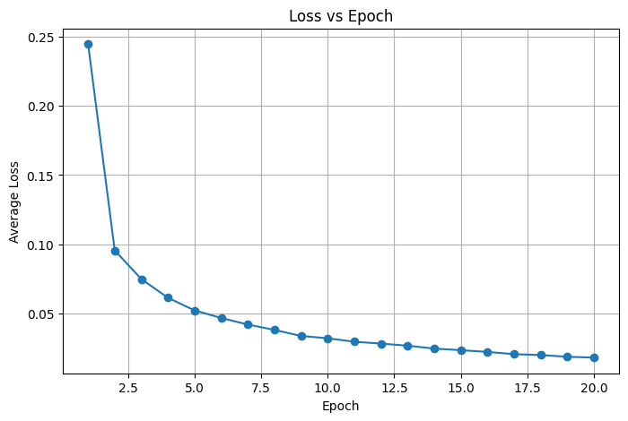
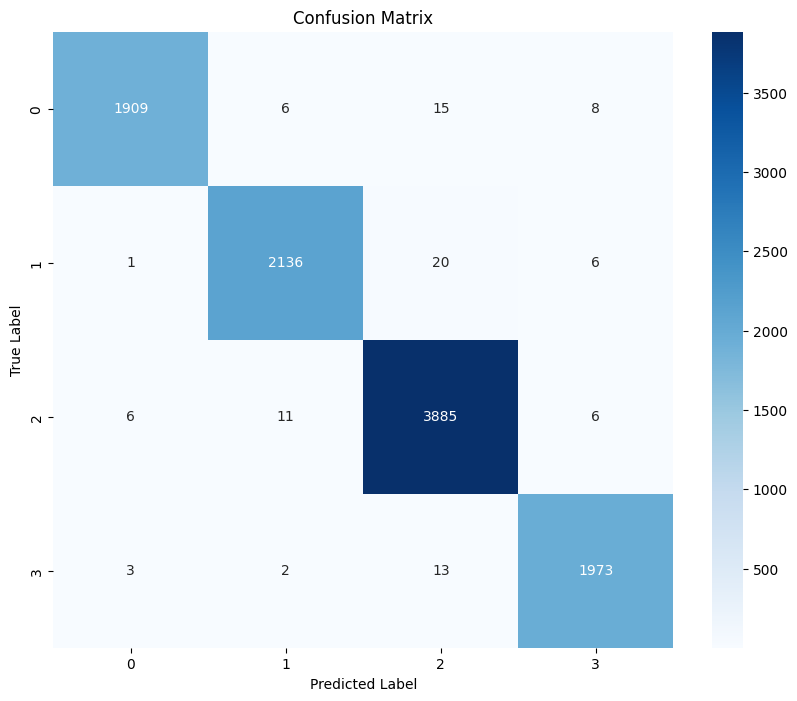

# Deep Classification on MNIST using Convolutional Neural Networks

## Introduction

This project explores image classification on the MNIST handwritten digit dataset using Convolutional Neural Networks (CNNs).

The assignment is divided into two parts:

### Part 1 : Standard Digit Classification

The model predicts the original MNIST digit labels:

```text
0,1,2,3,4,5,6,7,8,9
```

This is a 10-class classification problem.

---

### Part 2 : Deep Classification

Instead of predicting the original digits, digits are grouped into higher-level categories:

| Group | Digits |
|---------|---------|
| Class 0 | 0, 6 |
| Class 1 | 1, 7 |
| Class 2 | 2, 3, 5, 8 |
| Class 3 | 4, 9 |

This converts the problem into a 4-class classification task. :contentReference[oaicite:0]{index=0}

---

# Dataset

## MNIST

- 70,000 handwritten digit images
- Grayscale Images
- Resolution: 28 × 28
- 10 Digit Classes

Dataset Split:

- Training Images: 50,000
- Test Images: 10,000 

---

# Results

# Part 1 : Standard Digit Classification

## Test Accuracy

<p align="center">

</p>

### Final Accuracy

**98.57%** 

---

## Training Loss Curve

<p align="center">

</p>

---

## Confusion Matrix

<p align="center">

</p>

---

# Part 2 : Deep Classification

## Test Accuracy

<p align="center">

</p>

### Final Accuracy

**99.03%**

---

## Training Loss Curve

<p align="center">

</p>

---

## Confusion Matrix

<p align="center">

</p>

---

# Trainable Parameters

## Part 1 CNN

| Layer | Parameters |
|---------|---------:|
| CNN Block 1 | 800 |
| CNN Block 2 | 3208 |
| CNN Block 3 | 292 |
| Fully Connected Layer | 170 |
| Total Parameters | 4470 |


---

## Part 2 CNN

| Layer | Parameters |
|---------|---------:|
| CNN Block 1 | 800 |
| CNN Block 2 | 3208 |
| CNN Block 3 | 292 |
| Fully Connected Layer | 68 |
| Total Parameters | 4368 |


---

# Google Colab

🔗 https://drive.google.com/file/d/19-Cw8XrEedDTogkj7qhQDxvAIqEPK1sR/view?usp=drive_link

---

# Handwritten Report

📄 https://drive.google.com/file/d/1vRaCEGP9rgftlOwgyCeGJiu-XqpMyEZc/view?usp=drive_link

---

# Theory

# CNN Architecture

The input image size is:

```text
28 × 28 × 1
```

The network consists of three convolutional blocks followed by a fully connected classification layer. :contentReference[oaicite:6]{index=6}

---

## CNN Block 1

```text
Input Shape:
[B,1,28,28]

Conv2D
Kernel Size = 7
Stride = 1
Padding = 3

Output Channels = 16

ReLU Activation

Max Pooling
```

Output:

```text
[B,16,14,14]
```


---

## CNN Block 2

```text
Input:
[B,16,14,14]

Conv2D
Kernel Size = 5
Stride = 1
Padding = 2

Output Channels = 8

ReLU Activation

Max Pooling
```

Output:

```text
[B,8,7,7]
```


---

## CNN Block 3

```text
Input:
[B,8,7,7]

Conv2D
Kernel Size = 3
Stride = 2
Padding = 1

Output Channels = 4

ReLU Activation

Average Pooling
```

Output:

```text
[B,4,2,2]
```


---

## Part 1 Classification Head

```text
Flatten
    ↓
16 Features
    ↓
Fully Connected Layer
    ↓
10 Output Neurons
```

Used for digit classification.

---

## Part 2 Classification Head

```text
Flatten
    ↓
16 Features
    ↓
Fully Connected Layer
    ↓
4 Output Neurons
```

Used for grouped classification.

---

# Loss Function

Categorical Cross Entropy Loss is used because this is a multi-class classification problem.

```text
Loss = -Σ yi log(ŷi)
```

where:

- yi = Ground Truth Label
- ŷi = Predicted Probability


---

# Optimizer

Adam Optimizer is used for training.

Training Configuration:

| Parameter | Value |
|------------|------------|
| Batch Size | 128 |
| Epochs | 20 |
| Learning Rate | 0.001 |


---

# Key Observations

- Part 1 successfully classifies all 10 handwritten digit classes.
- Part 2 performs grouped classification using semantic digit groupings.
- Part 2 achieves higher accuracy due to the reduced number of output classes.
- The CNN architecture requires fewer than 5,000 trainable parameters, making it computationally efficient.
- Adam optimizer provides stable and fast convergence.

---

# Conclusion

This project demonstrates how Convolutional Neural Networks can be applied to both standard digit classification and hierarchical grouped classification on the MNIST dataset. The results show that CNNs can achieve high classification performance with a compact architecture and a small number of trainable parameters.

---

## Author

**Pranav Deshpande**  
* IIT Jodhpur

* Deep Learning 
* Computer Vision 
* CNNs 
* Image Classification
